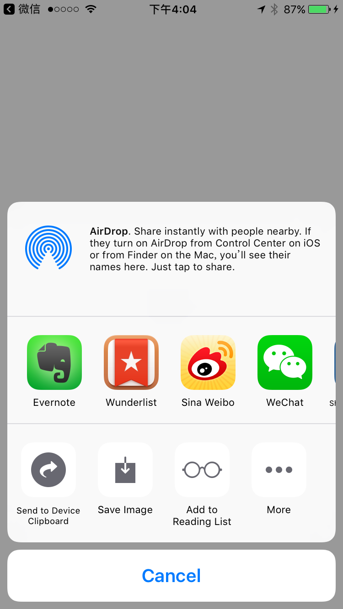
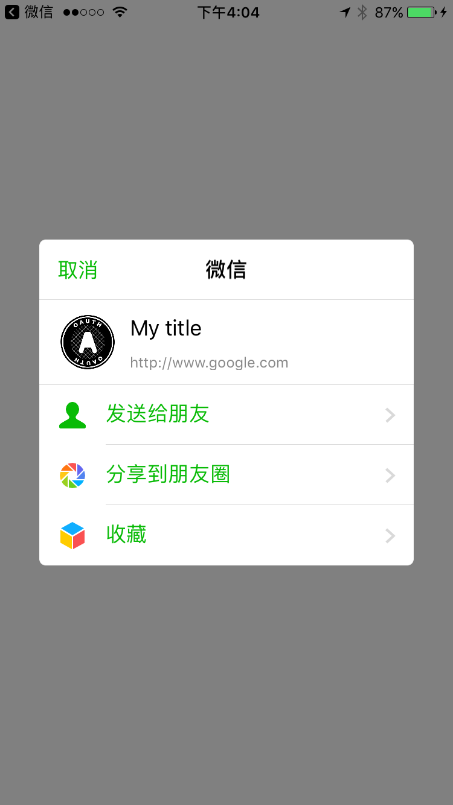

#WeixinActivitySwift

Rewrite [this project](https://github.com/iDay/WeixinActivity) in Swift

Using CocoaPods for [libWeChatSDK](https://cocoapods.org/pods/libWeChatSDK)

#Installation

- Clone the repository
- pod install

#TODO

- To package it in CocoaPods and Carthage
